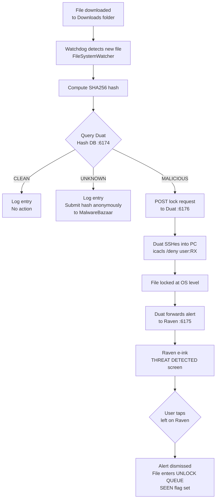
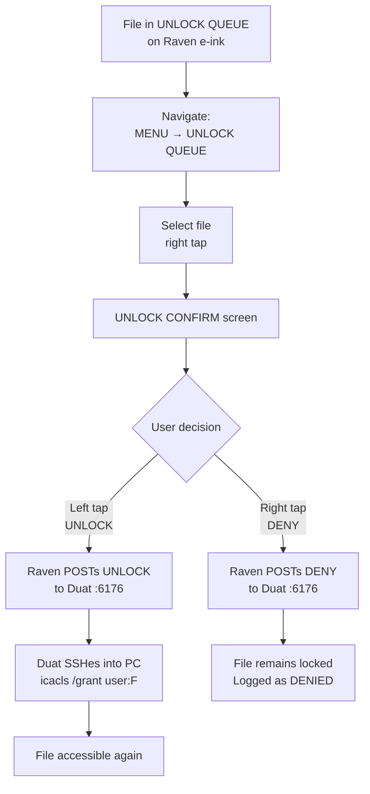
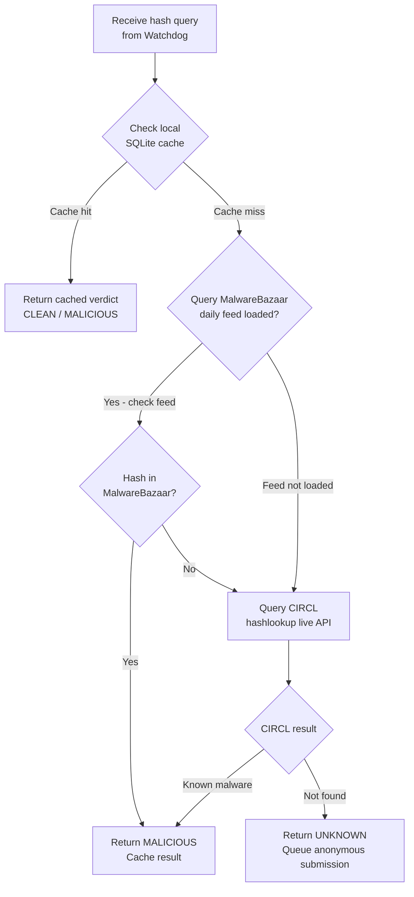
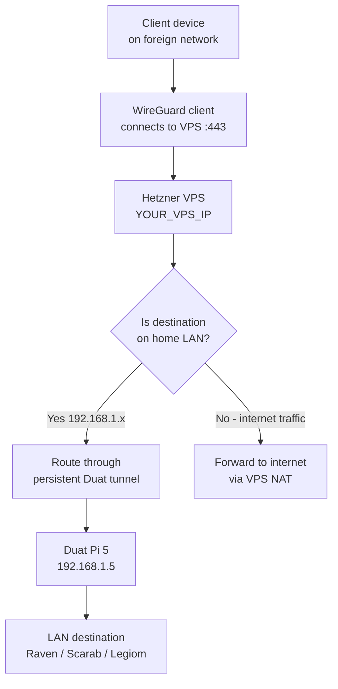
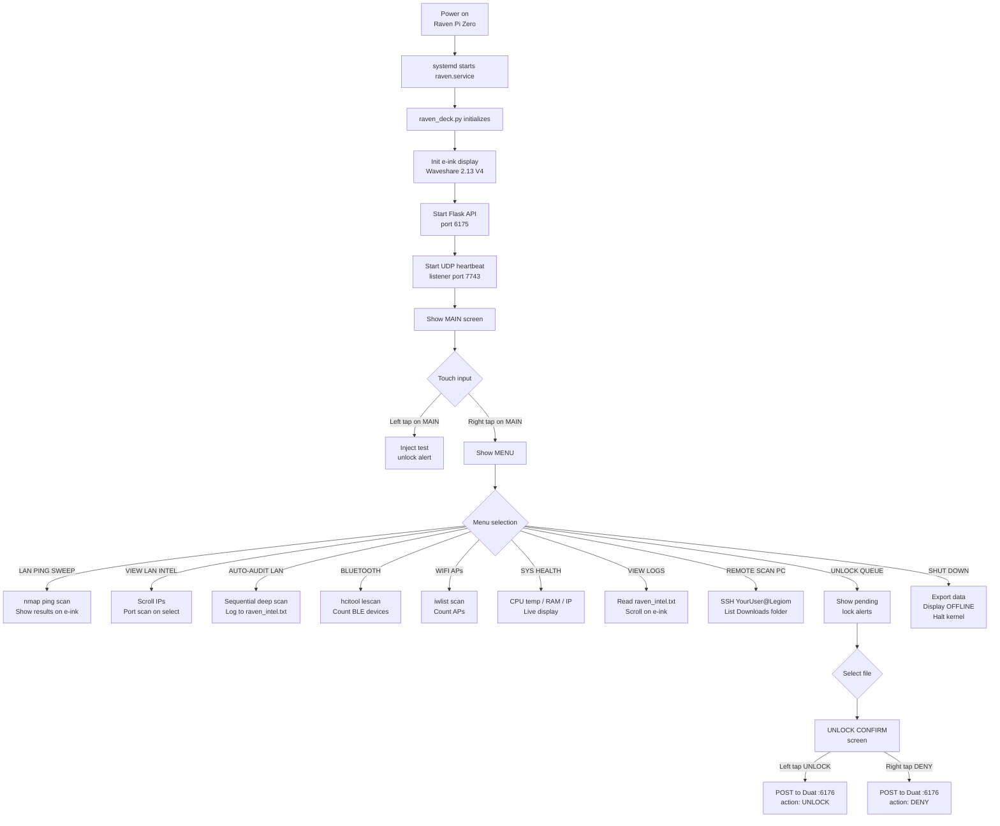
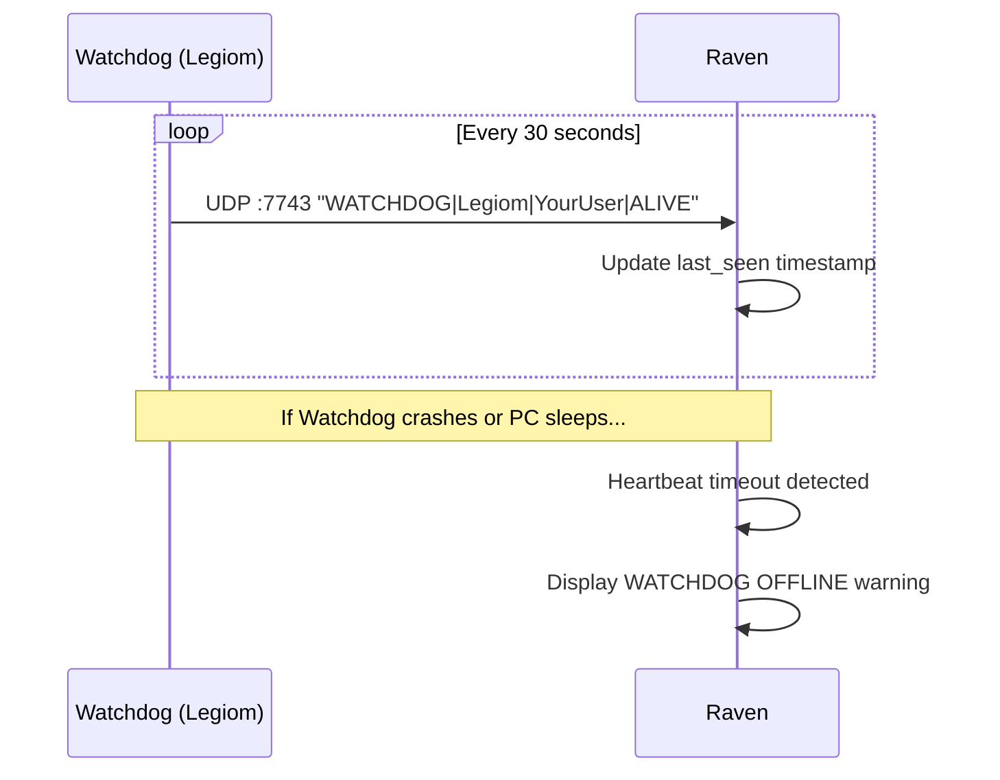
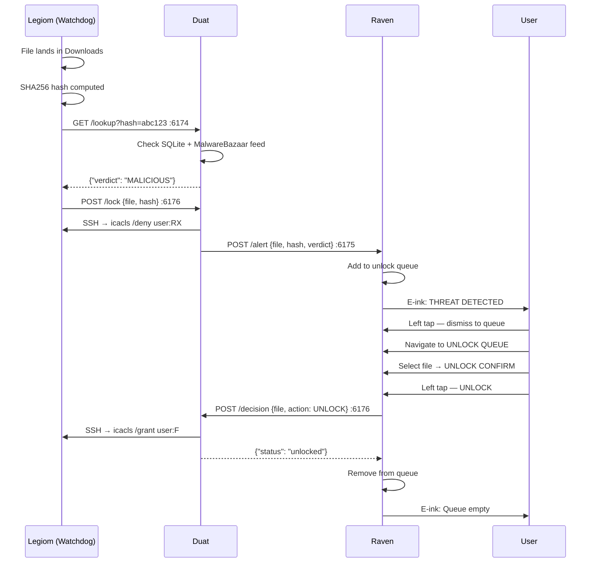
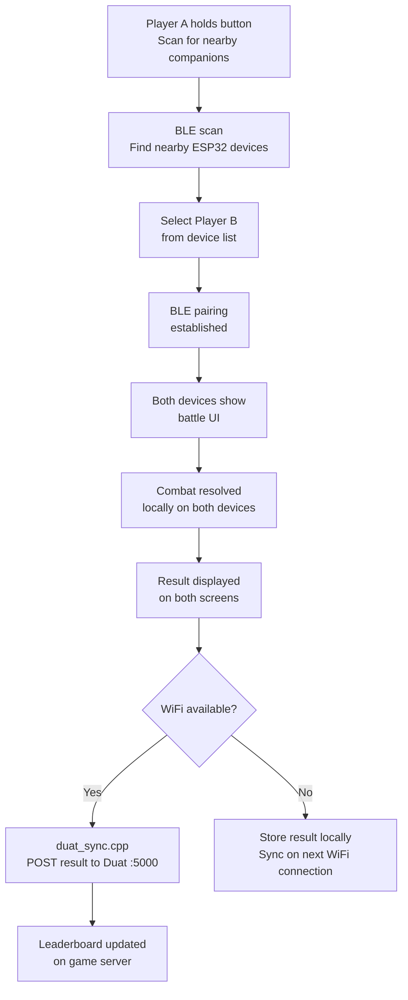
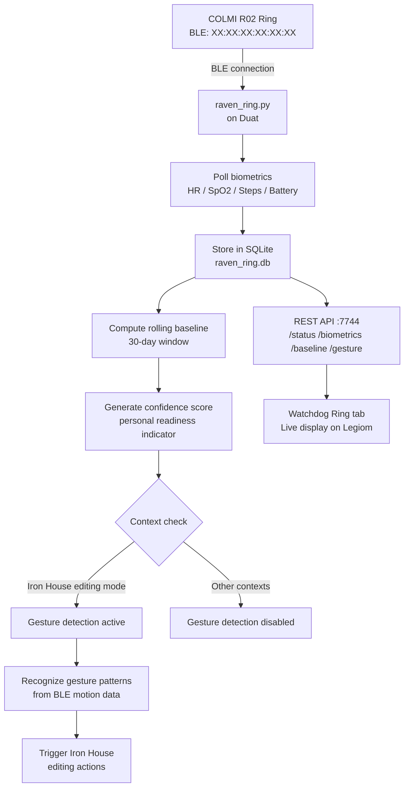

# System Flowcharts

Visual reference for the key flows in Raven OS. Rendered automatically on GitHub.

---

## File Threat Detection and Lock Flow

---

## Physical Unlock / Deny Flow

---

## Hash DB Lookup Flow

---

## WireGuard Connection Flow

---

## Raven Boot and Display Loop

---

## Heartbeat Monitoring Flow

---

## Full Security Chain — Sequence Diagram

---

## ESP32 Companion BLE Battle Flow

---

## Ring Biometric Pipeline

