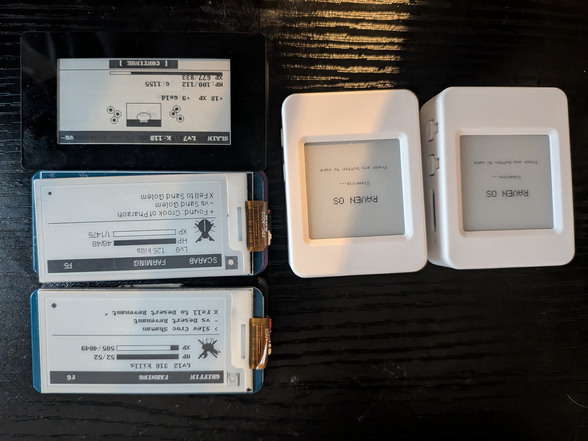
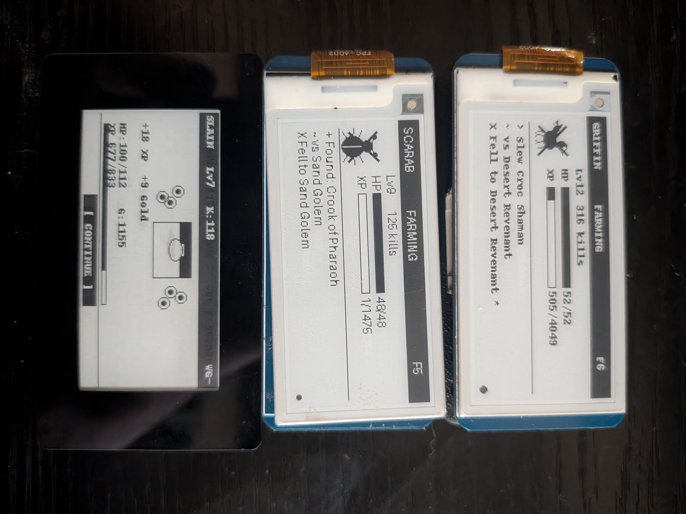

# Hardware Bill of Materials

Complete hardware list for every node in the Raven OS network.

## Photos

| All portable nodes — Pi Zero 2 W nodes + ESP32-S3 companions with LiPo batteries |
|---|
|  |

| Pi Zero 2 W + Waveshare 2.13" e-paper HAT — Raven, Scarab, and Griffin |
|---|
|  |

---

## Raven — Portable E-Ink Security Deck

The handheld device. Physical unlock confirmation lives here.

| Component | Part | Notes |
|-----------|------|-------|
| Compute | Raspberry Pi Zero 2 W | WiFi + Bluetooth onboard |
| Display | Waveshare 2.13" Touch E-Ink HAT (V4) | 250x122 px, 1-bit B/W, capacitive touch |
| Power | USB power bank, 10,000mAh recommended | Thermal separation from Pi |
| Storage | MicroSD card, 16GB+ | Class 10 / A1 |
| OS | Raspberry Pi OS Bookworm (64-bit Lite, headless) | |

**Display wiring:** The Waveshare 2.13" V4 is a HAT — connects directly to the 40-pin GPIO header. No additional wiring needed.

**Touch interface:** The e-ink glass is divided invisibly in half horizontally.
- Left half tap = cycle/action (scroll menus, trigger scans)
- Right half tap = select/back

Software debounce: 400ms. Use firm, deliberate taps.

---

## Duat — Home Base Server

The Pi 5 running the hash DB, unlock service, ring biometrics, and game server.

| Component | Part | Notes |
|-----------|------|-------|
| Compute | Raspberry Pi 5 (4GB or 8GB) | Active cooling recommended |
| Display | MHS 3.5" LCD HAT (480x320 RGB565) | Optional — `duat_display.py` drives it via /dev/fb0 |
| Storage | MicroSD 32GB+, or USB SSD | SSD preferred for SQLite write performance |
| Power | Official Pi 5 USB-C power supply (27W) | |
| OS | Raspberry Pi OS Bookworm (64-bit) | |

**Static IP:** Assign 192.168.1.5 in your router's DHCP reservation table (use Duat's MAC address).

**Services running on Duat:**

| Port | Service | Description |
|------|---------|-------------|
| 6174 | Hash DB API | Malware hash lookup — MalwareBazaar feed + CIRCL fallback |
| 6176 | Unlock Service | Receives lock/unlock commands, SSHes into PC |
| 7744 | Ring Biometric API | COLMI R02 ring data — HR, SpO2, steps, gestures |
| 5000 | Game Server | Ladder Slasher Flask app |
| 22 | SSH | Remote management |

---

## Scarab — Travel Router / VPN Node

Fiancée's travel companion. Runs WireGuard to tunnel back to Duat over any network.

| Component | Part | Notes |
|-----------|------|-------|
| Compute | Raspberry Pi Zero 2 W | |
| Storage | MicroSD 16GB+ | |
| Power | USB power bank or phone charger | |
| OS | Raspberry Pi OS Bookworm (64-bit Lite, headless) | |

**Network roles:**
- LAN IP: 192.168.1.2 (home network)
- WireGuard tunnel IP: 172.16.0.2
- Acts as WireGuard client, routing all traffic through VPS relay

Scarab also runs a headless dungeon game agent (`scarab_agent.py`) that auto-plays in the Ladder Slasher game when online.

---

## Griffin — Companion Node

Egyptian griffin companion with e-ink display and dungeon game agent.

| Component | Part | Notes |
|-----------|------|-------|
| Compute | Raspberry Pi Zero 2 W | |
| Display | Waveshare 2.13" Touch E-Ink HAT (V4) | Same model as Raven |
| Storage | MicroSD 16GB+ | |
| Power | USB power bank | |
| OS | Raspberry Pi OS Bookworm (64-bit Lite, headless) | |

Griffin's display driver (`griffin_display.py`) is identical to Raven's — same Waveshare V4 HAT on 40-pin GPIO.

---

## Legiom — Main Workstation

The Windows PC running the Watchdog GUI.

| Component | Spec |
|-----------|------|
| CPU | Intel Core i9 |
| GPU | NVIDIA RTX 5070 |
| RAM | 16GB |
| OS | Windows 11 |
| Software | Python 3.12, OpenSSH server, Watchdog GUI |

The Watchdog runs as a Python GUI application. It monitors the Downloads folder, hashes new files, queries Duat, and sends lock/unlock requests. The compiled `.exe` is built with PyInstaller.

---

## ESP32 Companion Device

Two portable companion devices with e-paper displays and BLE.

| Component | Part | Notes |
|-----------|------|-------|
| Board | Waveshare ESP32-S3 1.54" e-Paper AIoT Development Board | Built-in WiFi + BLE, 2 side buttons |
| Display | 200x200 px, black/white e-paper | Onboard, no wiring |
| Power | USB-C or LiPo battery | |
| Framework | Arduino via PlatformIO | |

**Three firmware targets (defined in `platformio.ini`):**

| Target | Node | Companion ID |
|--------|------|-------------|
| `raven` | Raven's companion | `companion_1` |
| `griffin` | Griffin's companion | `companion_3` |
| `scarab` | Scarab's companion | `companion_2` |

**Features:**
- Companion sprite display with stats
- Cyclable menu via physical buttons
- Local BLE peer-to-peer battle (no server required)
- Syncs battle results to Duat when WiFi available

---

## Biometric Ring

| Component | Part |
|-----------|------|
| Ring | COLMI R02 |
| Connection | BLE (Bluetooth Low Energy) |
| BLE Address | XX:XX:XX:XX:XX:XX |
| Device Name | YOUR_RING_NAME |

The user wears it on the right hand. The ring daemon (`raven_ring.py`) runs on Duat, connects to the ring over BLE, and stores biometrics in SQLite (`/home/raven/raven_ring.db`).

Data collected: heart rate, SpO2, step count, battery level.

The ring feeds a rolling baseline + confidence score — a personal readiness indicator, not a system gate. Gesture detection is context-isolated to Iron House editing mode only.

---

## Network Equipment

| Equipment | Model |
|-----------|-------|
| Router | Netgear Nighthawk R6700 |
| Subnet | 192.168.1.0/24 |
| VPS (WireGuard relay) | Hetzner Helsinki — bypasses T-Mobile CGNAT |

---

## Total Node Count

| Built | Node | Status |
|-------|------|--------|
| Yes | Raven (Pi Zero 2) | Deployed |
| Yes | Duat (Pi 5) | Deployed |
| Yes | Scarab (Pi Zero 2) | Deployed |
| Yes | Griffin (Pi Zero 2) | Deployed |
| Future | Anubis (Pi Zero 2) | Son's guardian node — not built |
