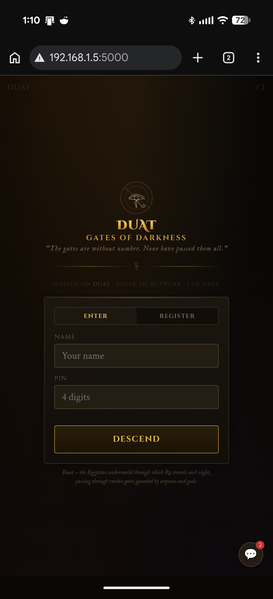
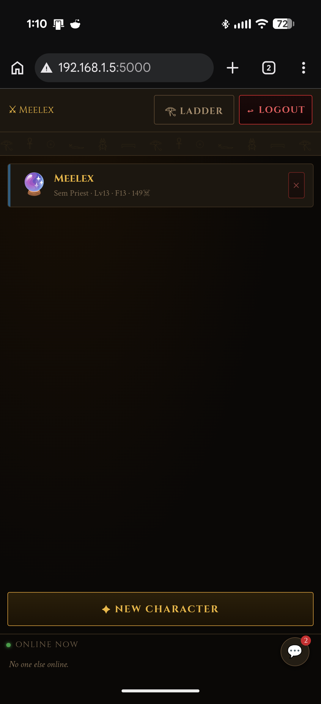
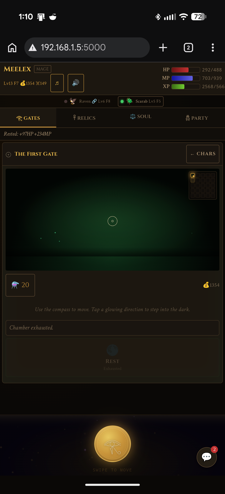
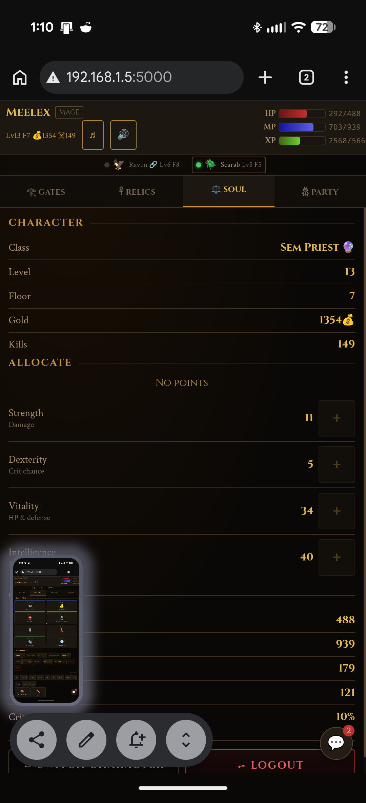
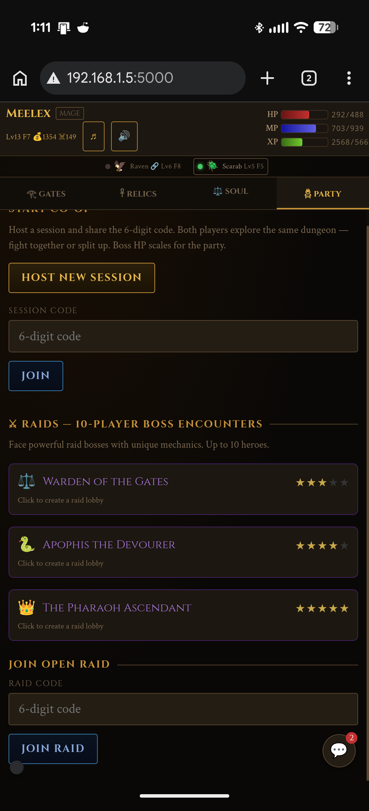
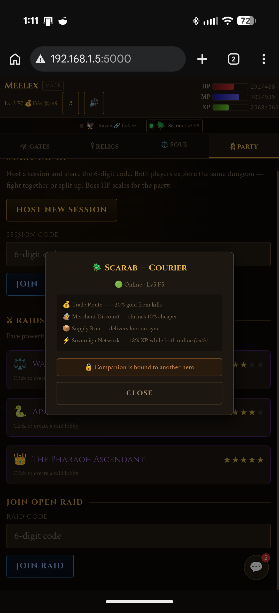

# Ladder Slasher — Game Design Reference

A LAN-hosted dungeon crawler built for the Raven OS home network. Players connect from any device on the LAN via browser. The server runs headless on Duat (Pi 5).

## Screenshots

| Login | Character Select | Main UI |
|-------|-----------------|---------|
|  |  |  |

| Soul / Attributes | Party & Raids | Companion Pet |
|------------------|--------------|---------------|
|  |  |  |

---

## Access

```
http://192.168.1.5:5000
```

No app install. Any device on the LAN opens this URL in a browser and plays.

---

## Architecture

```
Browser (phone, laptop, tablet)
    │ HTTP port 5000
    ▼
Duat Pi 5
    ├── Flask (app.py) — game API + serves HTML client
    ├── SQLite (ladder_slasher.db) — users, characters, ladder, sessions, chat
    └── systemd service — starts on boot, restarts on crash
```

The game client is a single HTML file served by Flask. All game state is server-authoritative.

---

## Classes

| Key | Name | Lore | Primary Stat | Passive |
|-----|------|------|-------------|---------|
| `fighter` | Medjay | Egyptian warrior elite | STR · VIT | Counter-Strike: 25% chance to deal 40% dmg back when hit |
| `barbarian` | Kushite | Nubian berserker | STR | Bloodlust: +8% dmg per hit taken, max 5 stacks, resets per fight |
| `rogue` | Shaduf | Shadow operative | DEX | Ambush: first strike vs each new enemy = guaranteed crit |
| `mage` | Sem Priest | Ritual spellcaster | INT | Arcane Body: all damage scales INT, skills ignore 50% armor |
| `ranger` | Nubian Archer | Desert marksman | DEX | Keen Eye: always acts first, first hit of each fight = crit |
| `samurai` | Shardana | Sea People bladesman | STR · DEX | Death Blow: 2× damage when enemy HP < 30% |

---

## Skills Per Class

Skills unlock at level milestones: L1 / L5 / L10 / L15

**Medjay (fighter):** Iron Strike · War Cry · Shield Bash · Last Stand
**Kushite (barbarian):** Rampage · Berserker's Howl · Cleave · Primal Rage
**Shaduf (rogue):** Serpent Strike · Hemorrhage · Shadow Step · Death Mark
**Sem Priest (mage):** Sekhmet's Wrath · Frost Chains · Soul Drain · Wrath of Ra
**Nubian Archer (ranger):** Arrow Storm · Piercing Shot · Rain of Arrows · Eagle Eye
**Shardana (samurai):** Dual Onslaught · Blade Flash · Iaijutsu · Void Cut

---

## Room Types

| Type | Frequency | Description |
|------|-----------|-------------|
| enemy | 45% | Monster encounter. Loot drops on kill |
| loot | 12% | Guaranteed item drop |
| trap | 10% | DEX-based disarm check (25% + DEX×4%, capped at 90%). Disarm=loot, spring=damage, skip=safe |
| shrine | 8% | Spend gold for HP or MP restoration (35% each, scales with floor) |
| merchant | 1 per floor | Sells Rejuvenation Potions (35% HP + 35% MP) |
| empty | ~25% | May have a rest point (12.5% roll on first entry) |
| boss | 1 per floor | Furthest room from start. Drops rare loot, unlocks stairs |
| stairs | 1 per floor | Locked until boss dies. Descend to next floor |

---

## Potions

One potion type: **Rejuvenation Potion** (⚗️). Restores 35% HP + 35% MP simultaneously. Players start with 2. Found in merchant rooms and some loot drops.

**Key binding:** `H` — use potion in combat or outside

---

## Controls

```
W / A / S / D  or  Arrow keys — Move (outside combat)
Space                          — Attack
1 / 2 / 3 / 4                 — Use skill
F                              — Flee combat
H                              — Use Rejuvenation Potion
R                              — Rest (outside combat, recovers HP/MP slowly)
```

---

## Hardcore Mode

Characters can be created as Hardcore. Hardcore character death is permanent — the character is deleted and preserved only in the ladder history. Hardcore characters sort separately on the leaderboard.

---

## Co-op

Two players can share a dungeon session. To start:
1. Player 1 creates a session from the character menu
2. Player 2 joins via the session ID or from the online players list
3. Both players see the same map
4. Combat is resolved server-side
5. Boss HP scales for two players
6. Session state is polled every 2.5 seconds

Note: Co-op skill effects are currently simplified server-side. Skill sync is on the backlog.

---

## Spectating

Click any online player from the main screen → Spectate button. Shows a 5×5 minimap and event log. Polls every 2.5 seconds.

---

## Chat

Global chat widget (💬 button) accessible from all screens. 200 character limit. Polls every 5 seconds.

---

## Leaderboard

The Ladder ranks all characters by kills. Separate tracks for alive, dead, hardcore, and softcore.

The Watchdog GUI on Legiom includes a SLASHER tab showing the live leaderboard. Auto-refreshes every 15 seconds. Rank badges: ★ top 3, ◆ top 10, ◉ rest. Deduplicates by character ID.

---

## API Endpoints

| Endpoint | Method | Purpose |
|----------|--------|---------|
| `/` | GET | Serve ladder_slasher.html |
| `/api/register` | POST | Create account |
| `/api/login` | POST | Login |
| `/api/characters` | GET | List characters for logged-in user |
| `/api/characters` | POST | Create character |
| `/api/characters/<id>` | PUT | Save character state |
| `/api/characters/<id>/delete` | POST | Delete character |
| `/api/ladder` | GET | Leaderboard |
| `/api/online` | GET | Players active in last 10 minutes |
| `/api/chat` | GET | Fetch recent chat messages |
| `/api/chat` | POST | Post chat message |
| `/api/sessions` | POST | Create co-op session |
| `/api/sessions/<id>` | GET | Poll session state |
| `/api/sessions/<id>/join` | POST | Join session |
| `/api/sessions/<id>/move` | POST | Move in dungeon |
| `/api/sessions/<id>/attack` | POST | Combat action |
| `/api/sessions/<id>/loot` | POST | Take loot |
| `/api/sessions/<id>/new_floor` | POST | Descend floor |

---

## Deployment

```bash
# On Duat
sudo mkdir -p /opt/raven-slasher
sudo cp app.py ladder_slasher.html /opt/raven-slasher/
pip3 install flask --break-system-packages

# Create systemd service
sudo nano /etc/systemd/system/raven-slasher.service
```

Service file contents:
```ini
[Unit]
Description=Ladder Slasher Game Server
After=network.target

[Service]
User=duat
WorkingDirectory=/opt/raven-slasher
ExecStart=python3 /opt/raven-slasher/app.py
Restart=always
RestartSec=5

[Install]
WantedBy=multi-user.target
```

```bash
sudo systemctl daemon-reload
sudo systemctl enable --now raven-slasher

# Verify
curl http://localhost:5000
```

---

## Backlog

- **Co-op skill sync** — server-side skill effect resolution for all skill types
- **Floor scaling balance** — review enemy stats and loot rarity at floors 5+
- **More room types** — vault (locked chest, key drops from elites), forge (upgrade equipment)
- **Skill tree branching** — 2-option choices at each milestone instead of linear unlock
- **Anubis integration** — when Anubis is built, low vitals feed into harder enemy scaling

---

## Autonomous Agents

Scarab and Griffin each run headless dungeon agents that auto-play in the game:

- `nodes/scarab/scarab_agent.py` — Scarab's pet dungeon AI
- `nodes/griffin/griffin_agent.py` — Griffin's dungeon agent

These connect to the game server on Duat and play autonomously. When they're online they show up in the player list and contribute to the shared realm.
