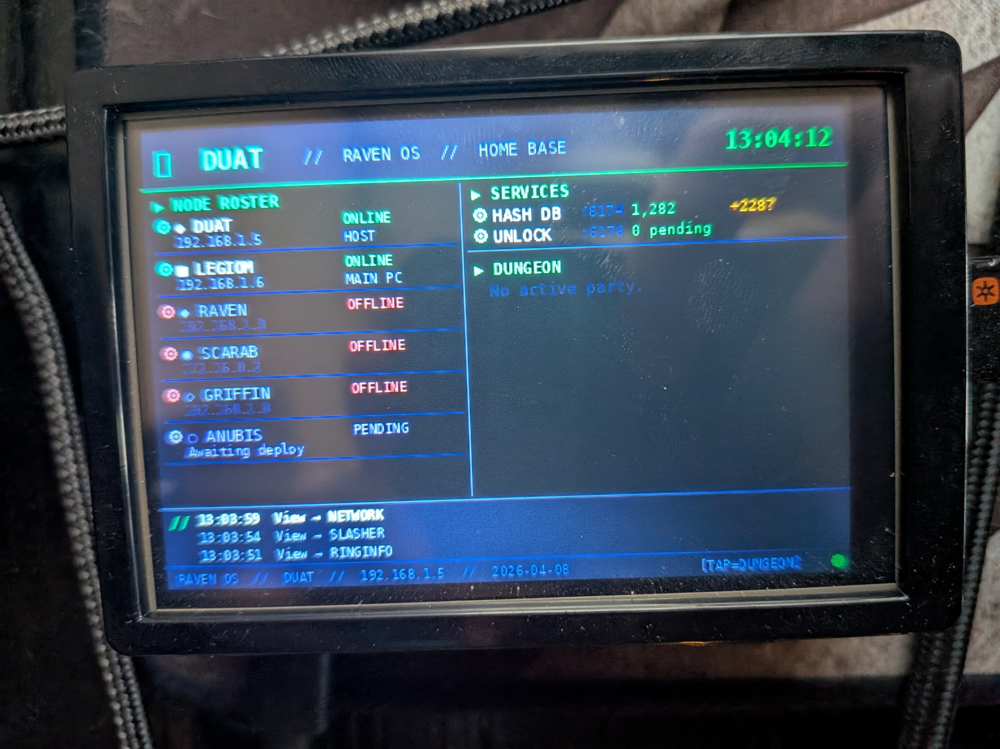

# Duat Node

Pi 5 running the home base services: malware hash DB, file unlock service, ring biometrics, color dashboard display, and the Ladder Slasher game server.



*Duat's MHS 3.5" LCD dashboard — node roster, service status, dungeon activity, and event log.*

---

## Hardware

- Raspberry Pi 5 (4GB or 8GB — 8GB recommended)
- Active cooling (official Pi 5 cooler or Argon case)
- MicroSD 32GB+ or USB SSD (SSD preferred for SQLite write performance)
- Optional: MHS 3.5" LCD HAT (480×320) for the color dashboard display
- Official Pi 5 USB-C power supply (27W)

**Static IP:** Reserve 192.168.1.5 in your router's DHCP table using Duat's MAC address.

---

## OS Setup

```bash
# Flash Raspberry Pi OS Bookworm (64-bit) to storage
# SSH in
ssh duat@192.168.1.5

sudo apt update
sudo apt install -y python3-pip python3-venv sqlite3

pip3 install flask colmi-r02-client --break-system-packages
```

---

## SSH Keys

Duat needs a key to SSH into Legiom (Windows PC) to lock and unlock files:

```bash
# On Duat
ssh-keygen -t ed25519 -C "duat@duat" -f ~/.ssh/duat_horus_key
cat ~/.ssh/duat_horus_key.pub
```

Add the output to `C:\ProgramData\ssh\administrators_authorized_keys` on Legiom.

Test:
```bash
ssh -i ~/.ssh/duat_horus_key YourUser@192.168.1.6 "echo connected"
```

---

## Files

| File | Purpose |
|------|---------|
| `raven_ring.py` | COLMI R02 ring daemon — BLE connection, biometrics, gesture detection |
| `raven_ring.service` | systemd unit for the ring daemon |
| `duat_display.py` | Optional color dashboard for MHS 3.5" LCD (480×320, /dev/fb0) |
| `ladder_slasher_server.py` | Ladder Slasher game server (Flask, port 5000) |
| `fix_hashdb_parser.sh` | Fix script for MalwareBazaar CSV parser |

**Note:** `raven_hashdb.py` (Hash DB service, port 6174) and `duat_unlock.py` (Unlock service, port 6176) are deployed directly to Duat. These are the core security services — see Architecture docs for their full spec.

---

## Services

Deploy each as a systemd service. Template:

```ini
[Unit]
Description=<service name>
After=network.target

[Service]
User=duat
WorkingDirectory=/home/duat
ExecStart=python3 /home/duat/<script>.py
Restart=always
RestartSec=5

[Install]
WantedBy=multi-user.target
```

### Hash DB (port 6174)

```bash
sudo systemctl status duat-hashdb
sudo systemctl restart duat-hashdb
sudo journalctl -u duat-hashdb -f
curl http://192.168.1.5:6174/health
curl http://192.168.1.5:6174/stats
```

The Hash DB pulls the MalwareBazaar daily feed, stores hashes in SQLite, and falls back to CIRCL hashlookup for live queries on misses. Unknown hashes are submitted back to MalwareBazaar anonymously.

### Unlock Service (port 6176)

```bash
sudo systemctl status duat-unlock
sudo systemctl restart duat-unlock
sudo journalctl -u duat-unlock -f
curl http://192.168.1.5:6176/health
```

Receives lock requests from the Watchdog, SSHes into Legiom to apply `icacls` locks, forwards alerts to Raven, and executes unlock/deny decisions from Raven.

### Ring Service (port 7744)

```bash
# Deploy
scp raven_ring.py raven_ring.service duat@192.168.1.5:/home/duat/
ssh duat@192.168.1.5

sudo cp /home/duat/raven_ring.service /etc/systemd/system/
sudo systemctl daemon-reload
sudo systemctl enable --now raven-ring

# Status
sudo systemctl status raven-ring
sudo journalctl -u raven-ring -f
curl http://192.168.1.5:7744/status
curl http://192.168.1.5:7744/biometrics/latest
curl http://192.168.1.5:7744/baseline
```

Ring hardware: COLMI R02, BLE `XX:XX:XX:XX:XX:XX`, device name `YOUR_RING_NAME`.

Calibrate gestures before connecting to Iron House:
```bash
python3 raven_ring.py --test-gestures
```

### Game Server (port 5000)

See [docs/LADDER_SLASHER.md](../../docs/LADDER_SLASHER.md) for full deployment instructions.

```bash
sudo systemctl status raven-slasher
sudo systemctl restart raven-slasher
sudo journalctl -u raven-slasher -f
```

---

## Database Locations

| DB | Location | Contents |
|----|----------|----------|
| Hash DB | `/home/duat/hashes.db` | Malware hashes, lookup history |
| Ring DB | `/home/raven/raven_ring.db` | HR, SpO2, steps, baseline history |
| Game DB | `/opt/raven-slasher/ladder_slasher.db` | Users, characters, sessions, chat |

---

## MalwareBazaar Parser

If the hash DB parser fails after a feed format change:

```bash
bash fix_hashdb_parser.sh
```

This patches the CSV parser in `raven_hashdb.py` to handle the current MalwareBazaar column layout.
